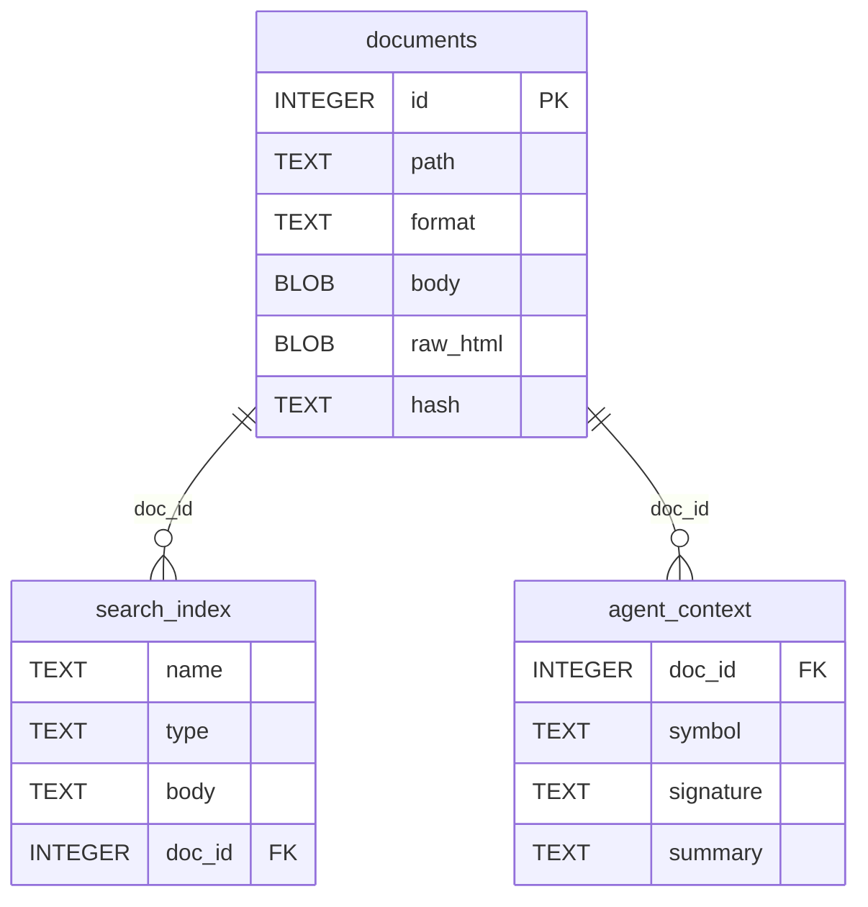

<!-- markdownlint-disable MD033 -->
# Documango

Documango is a terminal-first documentation browser for Go, Elixir, Rust, and other languages. It ingests source materials into a single SQLite database (`.usde`) with compressed Markdown, full-text search, and agent-friendly metadata.

## Requirements

- Go 1.24+ (module declares go 1.24.5)
- `rg` (ripgrep) optional for section extraction; falls back to `grep`

## Quick Start

Build the CLI:

```sh
task build
```

Create a database:

```sh
./tmp/documango db init -d ./tmp/docs.usde
```

Ingest a single Go stdlib package (e.g., `net/http`):

```sh
./tmp/documango ingest go -d ./tmp/docs.usde --stdlib -s net/http -m 1
```

Search:

```sh
./tmp/documango search -d ./tmp/docs.usde -l 10 Client
```

Read a document (raw markdown):

```sh
./tmp/documango doc -d ./tmp/docs.usde go/net/http
```

Read a document (rendered with Glamour):

```sh
./tmp/documango doc -d ./tmp/docs.usde -r -w 80 go/net/http
```

Extract a section by heading:

```sh
./tmp/documango doc section -d ./tmp/docs.usde -q "type Client" -r -w 80 go/net/http
```

## Commands

### Database

- `documango db init -d <path>`: create a `.usde` database
- `documango db add -d <path> -p <doc-path> -f <file>`: add a markdown file

### Search

- `documango search -d <path> -l <limit> <query>`

### Read

- `documango doc -d <path> [--render|-r] [--width|-w N] <doc-path>`
- `documango doc section -d <path> -q <heading> [--rg|--gr] [--render|-r] [--width|-w N] <doc-path>`

### Ingest

- `documango ingest go -d <path> [-v <version>] <module>`
- `documango ingest go -d <path> --stdlib [-v <go1.x.y>] [-s <start>] [-m <max>]`

## Ingesters

<details>
<summary><strong>Go</strong></summary>

Documango uses a single Go ingestion pipeline for both:

- Go modules via `proxy.golang.org`
- Go standard library via `pkg.go.dev` (directory list) + `go.googlesource.com` (archive fetch)

The standard library is **not** a separate docset. It is stored in the same Go namespace with paths like:

- `go/net/http`
- `go/crypto/tls`

Go ingestion extracts:

- Markdown docs via `gomarkdoc`
- FTS5 search entries
- Agent context (signatures + synopsis)

</details>

## Taskfile

- `task build`: build into `./tmp/`
- `task test`: run `go test ./...`
- `task format`: run `gofmt -w cmd internal`
- `task vet`: run `go vet ./...`

## Data Model

Documentation is stored in a single SQLite database, called Unified Semantic Documentation Engine (`.usde`).

<details>
<summary>SQLite schema overview</summary>

Documango stores all documentation in a single SQLite database (`.usde`). The design is intentionally simple and optimized for fast local search and cheap retrieval:

- `documents` holds compressed Markdown blobs, keyed by a virtual path (e.g., `go/net/http`).
- `search_index` is an FTS5 virtual table (trigram tokenizer) that supports fast substring search and ranking.
- `agent_context` stores low‑token summaries and signatures for fast AI retrieval without decompressing full docs.



</details>

## Notes

- Stdlib ingestion can be rate-limited by upstream. Use `-s`/`-m` to ingest in batches.
- The `doc section` command searches headings and returns the section until the next same-or-higher heading level.
