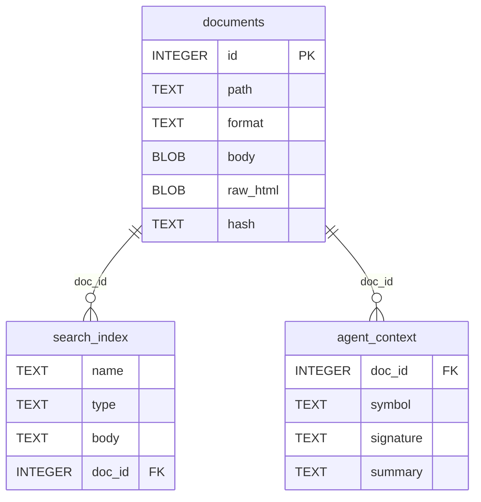

<!-- markdownlint-disable MD033 -->
# Documango

Documango is a terminal-first documentation browser for Go, AT Protocol, and other ecosystems. It ingests source materials into a single SQLite database (`.usde`) with compressed Markdown, full-text search, and agent-friendly metadata.

## Requirements

- Go 1.24+ (module declares go 1.24.5)
- `rg` (ripgrep) optional for section extraction; falls back to `grep`
- Git for AT Protocol ingestion

## Quick Start

Install & build the CLI:

```sh
go mod tidy
task build
```

Initialize a database:

```sh
./tmp/documango init -d ./tmp/docs.usde
```

Ingest AT Protocol documentation:

```sh
./tmp/documango add atproto atproto -d ./tmp/docs.usde
```

Search:

```sh
./tmp/documango search -d ./tmp/docs.usde -l 10 "repo"
```

Read a document (raw markdown):

```sh
./tmp/documango read -d ./tmp/docs.usde atproto/lexicon/com.atproto.repo.createRecord
```

Read a document (rendered with Glamour):

```sh
./tmp/documango read -d ./tmp/docs.usde -r -w 80 atproto/lexicon/com.atproto.repo.createRecord
```

Extract a section by heading:

```sh
./tmp/documango read section -d ./tmp/docs.usde -q "Definition" -r atproto/lexicon/com.atproto.repo.createRecord
```

## Usage

<details>
<summary>Configuration</summary>

Documango uses XDG Base Directory paths with `DOCUMANGO_HOME` override support:

- **macOS**: `~/Library/Application Support/documango/`
- **Linux**: `~/.local/share/documango/` (data), `~/.config/documango/` (config), `~/.cache/documango/` (cache)

Configuration is stored in TOML format:

```sh
./tmp/documango config show
./tmp/documango config set display.render_markdown true
./tmp/documango config edit
```

</details>

### Commands

<details>
<summary>Database</summary>

- `documango init [database-name]`: create a new `.usde` database
- `documango init -p /path/to/db.usde`: create at explicit path

</details>

<details>
<summary>Add (Ingest)</summary>

- `documango add go <module>`: ingest Go module from proxy.golang.org
- `documango add go --stdlib [-s <start>] [-m <max>]`: ingest Go stdlib packages
- `documango add atproto`: ingest AT Protocol lexicons, specs, and docs

</details>

<details>
<summary>Search</summary>

- `documango search [-l N] [-t TYPE] [-f FORMAT] <query>`
    - Formats: `table` (default), `json`, `paths`
    - Types: `Func`, `Type`, `Package`, `Lexicon`, etc.

</details>

<details>
<summary>Read</summary>

- `documango read [-r] [-w N] [-s SECTION] <path>`: read full document
- `documango read section -q <heading> [-r] [-w N] <path>`: extract section by heading
    - Flags: `--rg` (force ripgrep), `--gr` (force grep)

</details>

<details>
<summary>List & Info</summary>

- `documango list [--type PREFIX] [--tree] [--count]`: list all documentation paths
- `documango info <path>`: show document metadata

</details>

<details>
<summary>Cache</summary>

- `documango cache status`: show cache size and entry count
- `documango cache list [PREFIX]`: list cached items
- `documango cache prune [--age N]`: remove entries older than N days
- `documango cache clear [--type TYPE]`: clear cache

</details>

<details>
<summary>Config</summary>

- `documango config show`: display current configuration
- `documango config get <key>`: get configuration value
- `documango config set <key> <value>`: set configuration value
- `documango config edit`: open in $EDITOR
- `documango config path`: print config file path

</details>

<details>
<summary>Global Flags</summary>

- `-d, --database PATH`: database path (default: XDG data directory)
- `-v, --verbose`: enable verbose output
- `-q, --quiet`: suppress non-error output
- `--no-color`: disable colored output

</details>

## Ingesters

### Go

Documango uses a single Go ingestion pipeline for both:

- Go modules via `proxy.golang.org`
- Go standard library via `pkg.go.dev` (directory list) + `go.googlesource.com` (archive fetch)

**Caching**: Module zips and stdlib tarballs are cached indefinitely in `~/.cache/documango/` to avoid re-fetching.

The standard library is stored in the Go namespace with paths like:

- `go/net/http`
- `go/crypto/tls`

Go ingestion extracts:

- Markdown docs via `gomarkdoc`
- FTS5 search entries (name, type, body)
- Agent context (signatures + synopsis)

### AT Protocol

Ingests three documentation sources from Bluesky's GitHub repositories:

- **Lexicons**: JSON schemas converted to Markdown (`atproto/lexicon/*`)
- **Protocol Specs**: Technical specifications from atproto-website (`atproto/spec/*`)
- **Developer Docs**: Tutorials and guides from bsky-docs (`atproto/docs/*`)

## Data Model

Documentation is stored in a single SQLite database, called Unified Semantic Documentation Engine (`.usde`).

<details>
<summary>SQLite Schema</summary>

Documango stores all documentation in a single SQLite database (`.usde`). The design is intentionally simple and optimized for fast local search and cheap retrieval:

- `documents` holds compressed Markdown blobs, keyed by a virtual path (e.g., `go/net/http`)
- `search_index` is an FTS5 virtual table (trigram tokenizer) that supports fast substring search and ranking
- `agent_context` stores low‑token summaries and signatures for fast AI retrieval without decompressing full docs



</details>

## Notes

- Stdlib ingestion can be rate-limited by upstream. Use `-s`/`-m` to ingest in batches.
- The `read section` command searches headings and returns the section until the next same-or-higher heading level.
- Cache is stored in:
    - `~/.cache/documango/` (Linux)
    - `~/Library/Caches/documango/` (macOS)
- Default database is created in:
    - `~/.local/share/documango/default.usde` (Linux)
    - `~/Library/Application Support/documango/default.usde` (macOS)
